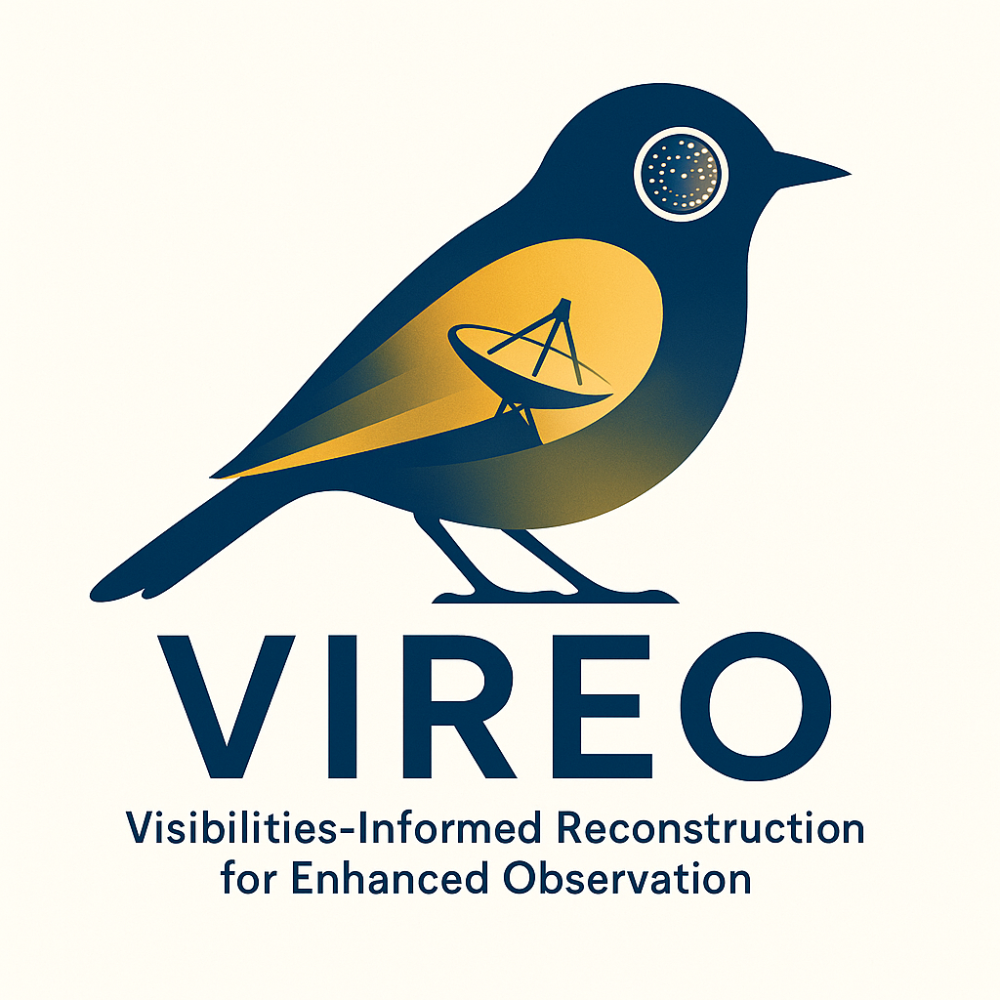
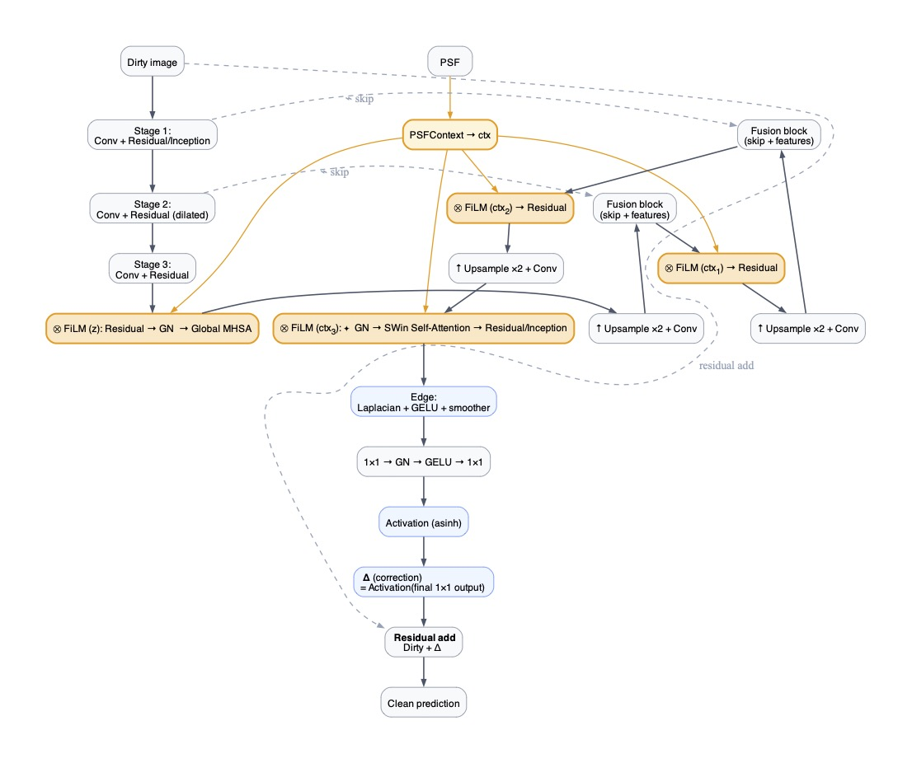
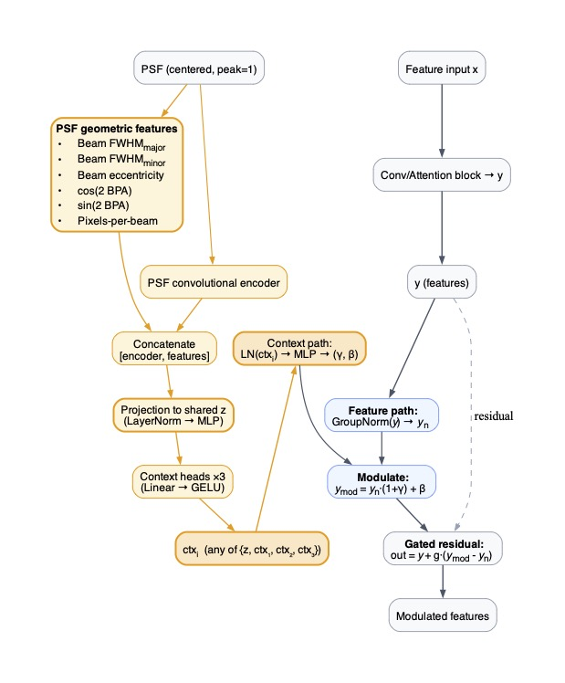

# VIREO: Visibilities-Informed Reconstruction for Enhanced Observations

[](https://doi.org/10.5281/zenodo.18019327)

<p align="center">
  
</p>

---

## Overview  

**VIREO** (Visibilities-Informed Reconstruction for Enhanced Observations) is a machine learning framework for reconstructing high-fidelity astronomical images from interferometric data.  
It is designed to push beyond traditional deconvolution (e.g., CLEAN) by leveraging multiscale priors, physics-informed constraints, and deep learning to **enhance the recovery of faint substructure** (spirals, wakes, planet-induced features) in protoplanetary discs and other extended sources.  

The goal: not just cleaner images, but **scientifically richer reconstructions** that improve our ability to detect and characterize faint features in noisy interferometric datasets, such as those from **ALMA** and the upcoming **SKA**.  

---

## Key Features  

- **Deep Learning Reconstruction**: PyTorch Lightning model trained to recover ground-truth images from synthetic interferometric “dirty” images.  
- **Physics-informed priors**: Incorporates PSFs directly in the network via unrolled Wiener steps and context conditioning (FiLM).  
- **Multiscale fidelity**: Supports perceptual losses (MS-SSIM) and wavelet-based starlet losses to ensure both *visual quality* and *astrophysical feature recovery*.  
- **Synthetic SKA simulator**: Generate realistic dirty images/noise using baseline distributions and sensitivity parameters.  
- **CLEAN comparison**: Interfaces with CASA to produce baseline reconstructions for benchmarking.  
- **Pretrained model**: Ships with `./weights/vireo.ckpt` for immediate testing.  

---

## Repository Structure  

```
.
├── run_vireo.py              # Entry point: train/test VIREO
├── utils/
│   ├── data_utils.py         # Data loading, preprocessing
│   ├── model_utils.py        # Helper functions for building blocks
│   ├── vireo.py              # Core PyTorch Lightning model
│   ├── make_ska_data.py      # Synthetic SKA dirty image simulator
│   └── casa_reconstructions.py # CASA interface for CLEAN benchmarking
├── weights/
│   └── vireo.ckpt            # Pretrained VIREO model
├── data/
│   ├── vireo_logo.png        # Repository logo
│   └── *.cfg                 # SKA configuration files
└── README.md
```

---

## Installation  

Clone the repo and install dependencies:  

```bash
git clone https://github.com/your-username/vireo.git
cd vireo
pip install -r requirements.txt
```

Dependencies include:  
- Python ≥ 3.12  
- PyTorch + PyTorch Lightning  
- NumPy, SciPy, Matplotlib  
- Astropy, CASA (for CLEAN benchmarks)  

---

## Usage  

### Training a Model  

To train VIREO on your dataset:  

```bash
python run_vireo.py --data_dir /path/to/training/data
```

### Testing / Evaluation  

To run evaluation using the pretrained weights:  

```bash
python run_vireo.py --test 1 --checkpoint_path ./weights/vireo.ckpt
```

### Generating Synthetic Data  

Create SKA-like synthetic dirty images and beams:  

```bash
python ./utils/make_ska_data.py --data_dir /path/to/clean/images --output_dir /path/to/dirty/images
```

### Benchmark with CASA CLEAN  

Run standard deconvolution on the same data, open up a CASA 6.7 instance, navigate to the directory containing the dirty images, and run the following command:

```bash
execfile('./utils/casa_reconstructions.py')
```

---

## Scientific Motivation  

Traditional CLEAN-based reconstructions can wash out faint signals or introduce strong artifacts.  
VIREO addresses this by:  

- Embedding the **PSF response** directly into the network, rather than treating it as post-processing.  
- Leveraging **multiscale losses** (MS-SSIM + starlet) to enforce fidelity to both perceptual appearance and astrophysical substructures.  
- Using **simulation-based training** with SKA/ALMA-like conditions to prepare the model for real interferometric challenges.  

With this approach, VIREO improves the recovery of faint planetary wakes, spirals, and other substructures that are crucial for understanding **planet formation and disk evolution**.  

---

## Model Architecture

To address this motivation, VIREO uses:
1. **PSF-aware conditioning via FiLM layers**: The PSF (or beam) is encoded into a context vector that modulates intermediate features.  
2. **Multi-scale feature fusion with attention**: Inception-style blocks, skip connections, and self-attention refine structures at multiple resolutions.

<p align="center">
  
</p>

---

## FiLM Conditioning

FiLM (Feature-wise Linear Modulation) layers allow VIREO to adapt dynamically to different PSFs.  
This is crucial since interferometers produce different beams depending on the configuration, frequency, and weighting scheme.

The FiLM block projects PSF features into per-channel scaling (`γ`) and shifting (`β`) parameters, which modulate intermediate features.

<p align="center">
  
</p>

---

## Pretrained Model  

We provide a ready-to-use model trained on synthetic SKA-like data:  

```
./weights/vireo.ckpt
```

Use this to quickly test the model on new datasets without retraining.  

---

## Citation  

If you use VIREO in your work, please cite:  

<!-- ```
@article{terry2025vireo,
  title={Denoising Interferometric Observations Using Visibilities-Informed Neural Networks},
  author={Terry, Jason and Hall, Cassandra and Gleyzer, Sergei},
  journal={...},
  year={20XX}
}
``` -->

---

## License  

This project is licensed under the Apache License, Version 2.0 and the Creative Commons Attribution 4.0 International License (CC BY 4.0) — see [LICENSE](LICENSE) for details.  

---

## Acknowledgements  

- The **SKA** and **ALMA** communities for motivating the challenge of high-fidelity reconstructions.  
- Open-source astronomy & machine learning projects (CASA, PyTorch Lightning, Astropy).  
